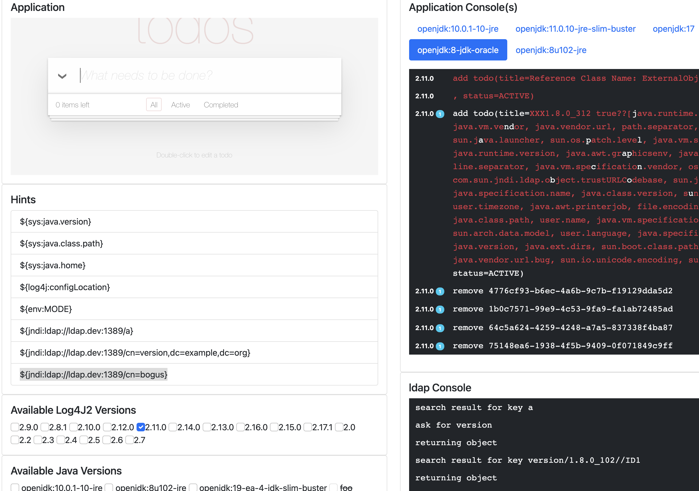

# log4j-hackapp

This application is designed to provide an easy way to explore the Log4Shell Vulnerability.


## To build
```
mvn compile package
docker-compose build 
```

## setup

Edit the javalevels.txt file in the root of the project.
Add the names of docker images that have Java installed to the list.
Note that the Java runtime in the image of your choice must be at least Java 8 and must be on the container classpath. 
All images listed must be in the local docker cache otherwise the will be shown by the tool but they will be disabled.

Simply pull the image before running this application 

```
docker pull <imagename>
```


## to run
```
docker-compose up 
```

Now open a browser to [localhost:8080](http:localhost:8080)

## to stop

stopping the compose setup incorrectly can leave dangling volumes around.
Not usually a big deal but if you're changing the contents of the driver module tree
things might not work exactly as expected.  

Bring compose down with 
```
docker-compose down -v 
```
for extra bells and braces
```
docker-compose rm -v 
```

## What you see 

 

In the top left is the application.  This is a slightly modified version of a cool spark java [app](https://github.com/tipsy/spark-intercooler) It's been modified to send log4J2 logging requests  to the controlling server via an http post.  

On the top right are a series of tabs that provide the console view for each Java runtime present.  You can move between them by selecting the tab as appropriate
As log requests from the application arrive they are executed by specific Java/log4j combination and the resulting output is added to the relevent console.
You can see the log4j version number on the left of the console in smaller numbers. The   small badges with a 1 or a 2 in them indicate that a particular property was active. 
Below the Java consoles are two more that are specifically to show the consoles for the LDAP server and DNS server respectfuly.  Important information from these servers will show what can be happening when a log4j request is made.  

Below the application view on the left is a a series of hints.  Try cut'n'pasting them into the application 
Below that are the configuration options for which log4j version and which java runtime to use. Picking more than one will cause the tool to run all the combinations
Below the config options are two buttons (not shown) that should be self evident in their purpose


# what to do 

Type something innocuous into the application on the top left.  Something like *buy milk* and press enter.   See the output appear on the Java console (you might have to choose the right tab for the selected Java version).   

Now try deleting the line. More log info appears.  

Now try something more interesting.  perhaps cut'n'paste *${sys:java.version}* into the app instead.  If the log results are the same then ok.  If what is logged is not actually what you entered the line added to the console will have red highlighting. 

Try selecting different versions of Java or log4j or turning on one or two of the properies listed (they can have an effect) What the output in the LDAP and DNS consoles to see if any important data leaks out.    


## How to change log4j versions

To add new log4j versions copy an existing module under drivr/log4jversions and amend to the version your require. 
Note that you **must** run a *mvn package* afterwards even for local development 

## dev mode

the application can be run outside docker in a development mode.  
Manually run the components.

- com.sonatype.demo.log4shell.FrontEnd   (in driver/server module)
- BasicTodoList   (in application module)
- com.sonatype.demo.log4shell.ldapserver.Main (in ldapserver module)


